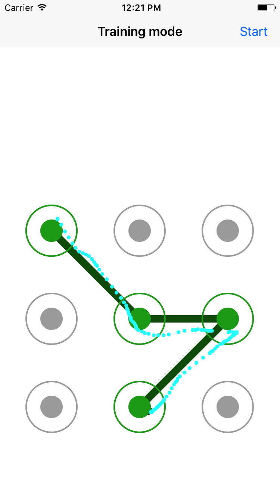
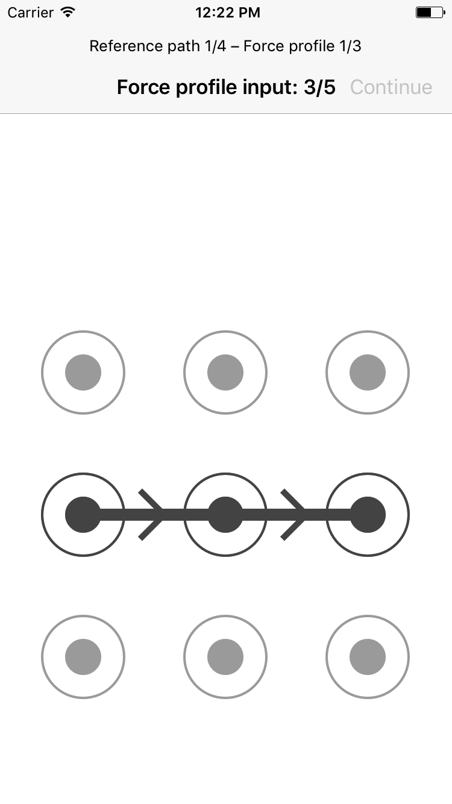

# unlockPatternWithForce
**A simple iOS app written during my Bachelor internship at INRIA Lille-Nord Europe, in Human-Computer Interactions.**

It is meant to record data for a scientific experiment, in an attempt to work on new unlock techniques.
It also was my first experience with Objective-C, iOS and OSX developement :).

### Goal and tasks
The goal was to record various data from the user drawings, as they attempted to enter unlock patterns with specific force profiles.
They were presented several patterns to draw, had to define multiple, different force profiles, and to enter them under different conditions.

Afterwards, the data has been analyzed, and various newly designed algorithms have been tested on it.
The proved to work relatively well, by offering better results than the ones previsouly obtained by [De Luca *et. al.* in 2012](https://dl.acm.org/citation.cfm?id=2208544).

### Technical details
The whole app is written in *Objective-C*, and is meant to be built in XCode!

It was mainly developed for an iPhone 6S; it expects a force-sensitive touchscreen to work well.
However, note that the core model can also be used with other devices: for instance, it also worked pretty well in an OSX app using force-sensitive touchpads.

### Screenshots
**Training mode with visual force feedback on**

**Force profile input mode**

