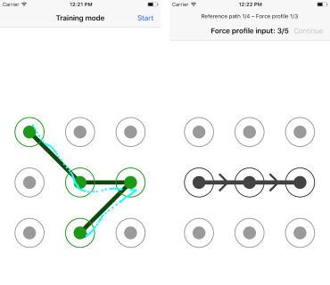

# unlockPatternWithForce
A simple iOS app developed during a HCI research internship at INRIA Lille-Nord Europe.

It has been used to **record data for a scientific experiment**.
It concerns a safer *unlock pattern* model, and the design of robust force matching algorithms.

## Technical details
The whole app is written in Objective-C, and is meant to be built in XCode.

It was mainly developed for an iPhone 6S (or newer), as it expects a force-sensitive touchscreen.
However, the core model can (and has) also be used with other devices (such as force-sensitive touchpads).

## Screenshots

